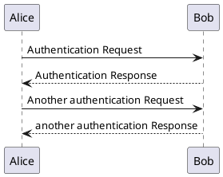

# with some emoji

- [button](button)
- [button1](button)
- [button2](button)
- [button3](button)

```css
.color: {
  color: orange
}
```


```plantuml
@startuml
Alice -> Bob: Authentication Request
Bob --> Alice: Authentication Response

Alice -> Bob: Another authentication Request
Alice <-- Bob: another authentication Response
@enduml
```